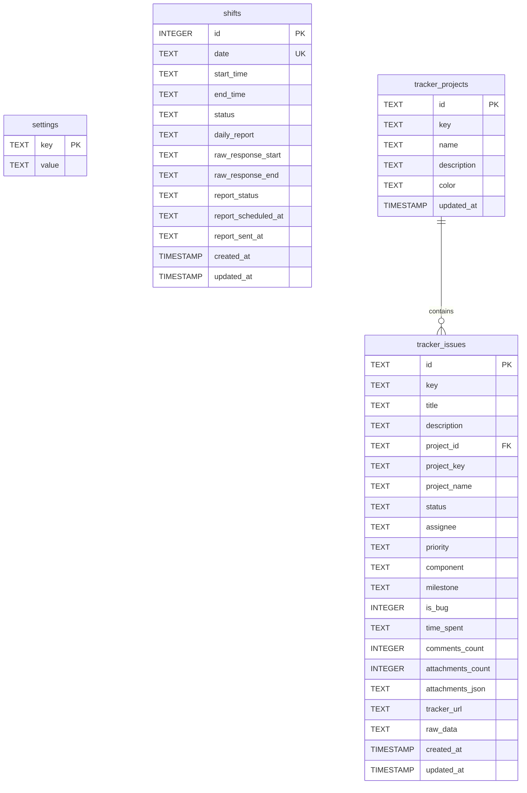

# 🗄️ Database Schema & Storage Architecture

## 1. Overview & Engine Specification

ITCO Dashboard uses **SQLite** as its persistent transactional storage engine, accessed asynchronously through Python's `aiosqlite` library.

### Key Architectural Characteristics
- **Asynchronous Execution**: All queries run asynchronously without blocking FastAPI's ASGI event loop (`aiosqlite.connect`).
- **Row Factory**: All query results use `db.row_factory = aiosqlite.Row` to allow dictionary-like and key-based column access.
- **Zero-External Dependencies**: Embedded database file requiring no standalone database server daemon, facilitating effortless single-container Docker deployments and instant local execution.

---

## 2. Database Initialization & Storage Lifecycle

```
[ Application Startup: lifespan ]
                │
                ▼
      ensure_db_initialized()
                │
    ┌───────────┴───────────┐
    ▼                       ▼
Check directory exists    Check DB file exists
(create if needed)        (seed from default if missing)
    │                       │
    └───────────┬───────────┘
                ▼
             init_db()
                │
    ┌───────────┴───────────┐
    ▼                       ▼
Create Tables (IF NOT)   Auto-Migrate Columns
                         (PRAGMA table_info check)
                            │
                            ▼
                    Seed Default Settings
```

- **Path Resolution**: Controlled via `DATABASE_PATH` environment variable:
  - **Local Development**: `backend/dashboard.db`
  - **Docker Container**: `/app/data/dashboard.db` (mapped via volume `./data:/app/data`)
- **Automatic Seed Replication**: If `DATABASE_PATH` points to a new volume where the database file does not yet exist, `ensure_db_initialized()` automatically copies the pre-packaged `dashboard.db` seed to the destination before initializing.

---

## 3. Entity-Relationship Diagram



---

## 4. Detailed Table Schemas

### 4.1. Table: `settings`
Stores dynamic application configuration, Microsoft Teams credentials, Huly session tokens, and custom webhook parameters.

| Column | Type | Constraints | Description |
|---|---|---|---|
| `key` | `TEXT` | `PRIMARY KEY` | Configuration parameter identifier |
| `value` | `TEXT` | | Stored string/JSON value |

#### Default Seed Values:
- `director_chat_url`: Teams conversation endpoint for morning shift start greeting.
- `director_message_template`: Default greeting message (*«Здравствуйте, я на рабочем месте»*).
- `daily_chat_url`: Teams conversation endpoint for daily shift reports.
- `auth_token`: Active SkypeToken / Bearer token.
- `auth_header_name`: HTTP header name (`Authentication` or `Authorization`).
- `custom_headers`: JSON string for extra HTTP headers (`{}`).
- `tracker_token`: Active Huly workspace JWT token.
- `tracker_account_id`: Huly user account ID.
- `tracker_account_name`: User email in Huly (`vepishin@it-co.ru`).
- `tracker_last_sync`: ISO timestamp of the last successful Huly synchronization.

---

### 4.2. Table: `shifts`
Maintains daily shift logs, stopwatch records, and automated Teams report delivery statuses.

| Column | Type | Nullable | Default | Description |
|---|---|---|---|---|
| `id` | `INTEGER` | No | `AUTOINCREMENT` | Primary record ID |
| `date` | `TEXT` | No | Unique (`YYYY-MM-DD`) | Calendar date of the shift |
| `start_time` | `TEXT` | Yes | `NULL` | Rounded arrival time (`HH:MM:SS`) |
| `end_time` | `TEXT` | Yes | `NULL` | Rounded departure time (`HH:MM:SS`) |
| `status` | `TEXT` | No | `'not_started'` | Lifecycle state: `not_started`, `in_progress`, `completed` |
| `daily_report` | `TEXT` | Yes | `''` | Full text of what was accomplished during the shift |
| `raw_response_start` | `TEXT` | Yes | `NULL` | JSON response returned by Teams API upon morning greeting |
| `raw_response_end` | `TEXT` | Yes | `NULL` | JSON response returned by Teams API upon daily report delivery |
| `report_status` | `TEXT` | No | `'not_scheduled'` | Delivery state: `not_scheduled`, `scheduled`, `sending`, `sent`, `failed` |
| `report_scheduled_at`| `TEXT` | Yes | `NULL` | Planned time for automated report delivery (e.g. `18:00:00`) |
| `report_sent_at` | `TEXT` | Yes | `NULL` | Actual timestamp when Teams confirmed report delivery |
| `created_at` | `TIMESTAMP` | Yes | `CURRENT_TIMESTAMP` | Row creation timestamp |
| `updated_at` | `TIMESTAMP` | Yes | `CURRENT_TIMESTAMP` | Last modification timestamp |

---

### 4.3. Table: `tracker_projects`
Caches Huly project spaces available to the user.

| Column | Type | Constraints | Description |
|---|---|---|---|
| `id` | `TEXT` | `PRIMARY KEY` | Project identifier (lowercase, e.g. `itco`, `mks`) |
| `key` | `TEXT` | | Project prefix code (e.g. `ITCO`, `МКС`) |
| `name` | `TEXT` | `NOT NULL` | Human-readable project name |
| `description` | `TEXT` | Default `''` | Project summary description |
| `color` | `TEXT` | Default `'#3b82f6'` | Hex color code for UI badge rendering |
| `updated_at` | `TIMESTAMP` | Default `CURRENT_TIMESTAMP` | Last cache update timestamp |

---

### 4.4. Table: `tracker_issues`
Caches assigned tasks synchronized from Huly Tracker with rich metadata and normalized markdown.

| Column | Type | Constraints | Description |
|---|---|---|---|
| `id` | `TEXT` | `PRIMARY KEY` | Huly internal GUID (e.g. `6a96...`) |
| `key` | `TEXT` | `NOT NULL` | Issue human identifier (e.g. `МКС-189`, `ITCO-42`) |
| `title` | `TEXT` | `NOT NULL` | Issue title / headline |
| `description` | `TEXT` | Default `''` | Normalized Markdown body with local image links |
| `project_id` | `TEXT` | | Associated project ID |
| `project_key` | `TEXT` | | Project prefix |
| `project_name` | `TEXT` | | Project display name |
| `status` | `TEXT` | `NOT NULL`, Default `'todo'` | Normalized status (`todo`, `in_progress`, `review`, `ready_for_testing`, `testing`, `ready_to_merge`) |
| `assignee` | `TEXT` | Default `''` | Assignee email |
| `priority` | `TEXT` | Default `'normal'` | `normal` or `urgent` |
| `component` | `TEXT` | Default `''` | Subsystem / module |
| `milestone` | `TEXT` | Default `''` | Target sprint / milestone |
| `is_bug` | `INTEGER` | Default `0` | Boolean flag (1 = Bug, 0 = Task/Feature) |
| `time_spent` | `TEXT` | Default `''` | Reported work duration |
| `comments_count` | `INTEGER` | Default `0` | Total number of comments |
| `attachments_count` | `INTEGER` | Default `0` | Number of attached files/images |
| `attachments_json` | `TEXT` | Default `'[]'` | JSON array of local attachment URLs |
| `tracker_url` | `TEXT` | Default `''` | Direct link to card in Huly web interface |
| `raw_data` | `TEXT` | Default `'{}'` | Full raw Huly issue JSON payload |
| `created_at` | `TIMESTAMP` | Default `CURRENT_TIMESTAMP` | Cache record creation timestamp |
| `updated_at` | `TIMESTAMP` | Default `CURRENT_TIMESTAMP` | Last status or data update timestamp |

---

## 5. Migration Strategy & Schema Evolution

ITCO Dashboard uses an in-code automatic migration strategy that executes upon startup inside `init_db()`:

```python
# backend/app/database.py
async def init_db():
    async with aiosqlite.connect(DB_PATH) as db:
        # 1. Base table creation (IF NOT EXISTS)
        ...

        # 2. Dynamic column migrations for existing databases
        async with db.execute("PRAGMA table_info(shifts)") as cursor:
            columns = [row[1] for row in await cursor.fetchall()]
            if "report_status" not in columns:
                await db.execute("ALTER TABLE shifts ADD COLUMN report_status TEXT NOT NULL DEFAULT 'not_scheduled'")
            if "report_scheduled_at" not in columns:
                await db.execute("ALTER TABLE shifts ADD COLUMN report_scheduled_at TEXT")
            if "report_sent_at" not in columns:
                await db.execute("ALTER TABLE shifts ADD COLUMN report_sent_at TEXT")

        # 3. Dynamic columns for tracker issues
        for col_def in [
            "component TEXT DEFAULT ''",
            "milestone TEXT DEFAULT ''",
            "is_bug INTEGER DEFAULT 0",
            "time_spent TEXT DEFAULT ''",
            "comments_count INTEGER DEFAULT 0",
            "attachments_count INTEGER DEFAULT 0",
            "attachments_json TEXT DEFAULT '[]'"
        ]:
            try:
                await db.execute(f"ALTER TABLE tracker_issues ADD COLUMN {col_def}")
            except Exception:
                pass  # Column already exists
```

---

## 6. Upsert Patterns & Conflict Handling

### 6.1. Settings Upsert
```sql
INSERT INTO settings (key, value)
VALUES (?, ?)
ON CONFLICT(key) DO UPDATE SET value=excluded.value;
```

### 6.2. Issue Cache Upsert with Rich Description Preservation
When syncing issues, incoming records might have empty descriptions if not fetched via the collaborator. The upsert logic ensures local rich descriptions and attachment counts are not overwritten with empty values:

```sql
INSERT INTO tracker_issues (
    id, key, title, description, project_id, project_key, project_name,
    status, assignee, priority, component, milestone, is_bug, time_spent,
    comments_count, attachments_count, attachments_json, tracker_url, raw_data, updated_at
)
VALUES (?, ?, ?, ?, ?, ?, ?, ?, ?, ?, ?, ?, ?, ?, ?, ?, ?, ?, ?, CURRENT_TIMESTAMP)
ON CONFLICT(id) DO UPDATE SET
    key=excluded.key,
    title=excluded.title,
    description=CASE WHEN excluded.description != '' THEN excluded.description ELSE tracker_issues.description END,
    project_id=excluded.project_id,
    project_key=excluded.project_key,
    project_name=excluded.project_name,
    status=excluded.status,
    assignee=excluded.assignee,
    priority=excluded.priority,
    component=excluded.component,
    milestone=excluded.milestone,
    is_bug=excluded.is_bug,
    time_spent=excluded.time_spent,
    comments_count=CASE WHEN excluded.comments_count > 0 THEN excluded.comments_count ELSE tracker_issues.comments_count END,
    attachments_count=CASE WHEN excluded.attachments_count > 0 THEN excluded.attachments_count ELSE tracker_issues.attachments_count END,
    attachments_json=CASE WHEN excluded.attachments_json != '[]' AND excluded.attachments_json != '' THEN excluded.attachments_json ELSE tracker_issues.attachments_json END,
    tracker_url=excluded.tracker_url,
    raw_data=excluded.raw_data,
    updated_at=CURRENT_TIMESTAMP;
```
