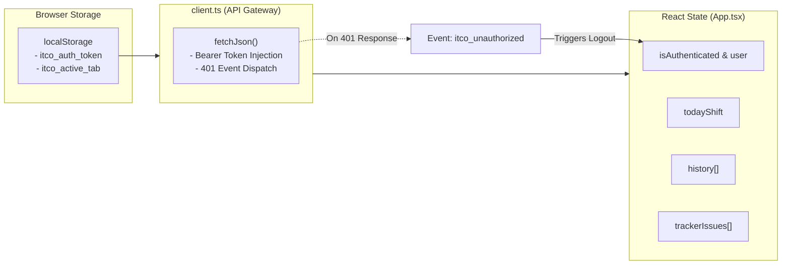

# 🎨 Frontend Architecture & Design System

## 1. Overview & Technology Stack

The ITCO Dashboard frontend is built as a Single Page Application (SPA) using:
- **Core Framework**: React 18.3.1 with TypeScript 5.6.3
- **Build Tooling**: Vite 6.0.5 with Fast Refresh (HMR)
- **Styling**: Tailwind CSS 3.4.16 adhering strictly to the **Refero Minimalist Design System**
- **Icons**: Lucide React 0.468.0
- **Spreadsheet Generation**: XLSX (SheetJS) 0.18.5

---

## 2. Refero Minimalist Design System Principles

The application adheres to clean, restrained enterprise design principles:

### 2.1. Color Palette & Canvas
- **Background**: Soft neutral canvas `#f8fafc` (`bg-slate-50` / `bg-[#f8fafc]`).
- **Cards & Surfaces**: Clean white (`bg-white`) with subtle hairlines (`border-slate-200/80`).
- **Typography Hierarchy**: Dark slate `#0f172a` (`text-slate-900`) for primary headings, `#334155` (`text-slate-700`) for body text, and `#94a3b8` (`text-slate-400`) for metadata.
- **Accents**: Restrained functional accents — Sapphire Blue for primary actions/links, Emerald for success/active states, Amber for scheduled/warning states, and Rose for bug badges and errors.

### 2.2. Numeric & Monospace Invariants
- **`tabular-nums`**: Applied to all timers, monetary figures, and dates to ensure digit alignment without jitter during live accrual.
- **Font Monospace**: `font-mono` applied to issue keys (`МКС-189`), timestamps (`10:00:00`), and currency values (`1 667.00 ₽`).

### 2.3. No "AI-Slop" / Motion Restraint
- **Zero Bouncy Transforms**: Avoid disruptive `scale()` or spring animations on cards.
- **Subtle Feedback**: Clean color transitions (`transition-colors duration-150`), crisp border glows on focus/drag (`ring-2 ring-blue-400/30`), and soft backdrop blurs (`backdrop-blur-xs` / `backdrop-blur-md`).

---

## 3. Component Hierarchy Tree

```
App.tsx (Root State, Auth, Tab Router & Toast Container)
├── Sidebar.tsx (Navigation rail, user profile, live shift status badge)
│
├── [Main View Container]
│   │
│   ├── ShiftView.tsx (Shift timer, salary accrual cards, report editor)
│   │
│   ├── TrackerView.tsx (6-Column Kanban Board)
│   │   ├── KanbanColumn.tsx (Column container with issue count)
│   │   │   └── KanbanCard.tsx (Task card with key, assignee & project tag)
│   │   ├── TaskDetailModal.tsx (Task detail modal with Markdown renderer)
│   │   └── ImageLightbox.tsx (Fullscreen screenshot viewer)
│   │
│   └── HistoryView.tsx (Historical shift ledger & Excel exporter)
│       └── [Shift Edit Modal via React Portal]
│
├── SettingsModal.tsx (Settings modal dialog)
│   ├── TeamsSettingsTab.tsx (Teams OTP email login, chat picker, test ping)
│   ├── TrackerSettingsTab.tsx (Huly login, sync trigger, log modal)
│   └── ShiftResetTab.tsx (Shift reset controls)
│
├── LoginView.tsx (Username/password authentication view)
└── Toast.tsx (Global toast notification stack)
```

---

## 4. Screen-by-Screen Breakdown

### 4.1. Shift View (`ShiftView.tsx`)
The primary daily workspace for the engineer. It features:
- **Top Bar**: Current date, live digital clock, monthly accumulated earnings, and current shift badge (`Смена не начата`, `Смена активна`, `Смена завершена (отчёт в 18:00)`, `Смена завершена`).
- **Left Column (3 Metric Cards)**:
  1. *Начало смены*: One-click «Я на смене» button (triggers Teams greeting and sets start time to rounded 10:00:00).
  2. *Рабочее время*: 50ms interval digital stopwatch (`HH:MM:SS.t`) with progress bar towards the 8.0-hour goal.
  3. *Доход за месяц*: Real-time live earnings counter ticking up (~0.06 ₽/s) + today's earned badge.
- **Right Column (Report Editor)**:
  - Full-height textarea for typing what was accomplished.
  - Auto-saving draft indicator (saves to SQLite every 1,000 ms of inactivity).
  - «Завершить смену» button (triggers automatic scheduling if before 18:00:00 or immediate dispatch if $\ge$ 18:00).
  - «Отправить сейчас» button to override scheduling and dispatch the report to Teams immediately.

### 4.2. Tracker View (`TrackerView.tsx`)
Provides a Kanban view synchronized with Huly Tracker:
- **Columns**: 6 discrete stages: `Todo`, `In progress`, `review`, `ready for testing`, `Testing`, `Ready for merge`.
- **Drag-and-Drop Interaction**: Native HTML5 Drag-and-Drop allows dragging cards between columns with immediate 0ms optimistic UI repositioning.
- **Card Metadata**: Displays issue key, title, project badge, external link to Huly, and assignee avatar with online indicator.
- **Detail Modal (`TaskDetailModal.tsx`)**:
  - Breadcrumb navigation (`[Icon] МКС › МКС-189`).
  - Custom Markdown renderer parsing semantic labels (`**ОР:**`, `**ФР:**`, `**Вопрос:**`, `**Ответ:**`), numbered lists, bullet lists, and embedded screenshots.
  - Attachment gallery grid with instant zoom capability.
  - Direct status transition action buttons.
- **Image Lightbox (`ImageLightbox.tsx`)**: Fullscreen overlay with dark backdrop blur (`bg-slate-950/85`) and keyboard `Escape` dismissal.

### 4.3. History View (`HistoryView.tsx`)
Comprehensive audit log of previous shifts:
- **Monthly Filter Tabs**: Quick filter by current or previous months with badge counters.
- **Full-Text Search**: Live search by date or report text contents.
- **Summary Metrics**: Total shifts, completed shifts, and shifts with reports.
- **Interactive Shift Ledger**: Expandable rows displaying date, status, start time, end time, calculated duration, and daily report snippet.
- **Direct Excel / CSV Export**: Uses `xlsx` library to generate formatted monthly timesheet spreadsheets (`ITCO_Табель_YYYY-MM_YYYY-MM-DD.xlsx`) with summary rows and column widths.
- **Modal Editor (React Portal)**: Allows editing start/end times and report text or deleting shift records.

---

## 5. State Management & API Communication Layer



### 5.1. Centralized API Fetcher (`frontend/src/api/client.ts`)
- Automatically attaches `Authorization: Bearer <token>` from `localStorage` to every request.
- Intercepts HTTP 401 responses, removes the stored JWT, and dispatches a global `itco_unauthorized` window event that transitions the UI to `LoginView.tsx` without full page reload.

### 5.2. Conflict-Free Optimistic Updates (`pendingUpdatesRef`)
When dragging a task card across columns in `TrackerView.tsx`:
```typescript
// frontend/src/components/TrackerView.tsx
const pendingUpdatesRef = React.useRef<Map<string, TrackerStatus>>(new Map());

const handleStatusChange = async (issueKey: string, targetStatus: TrackerStatus) => {
  // 1. Record optimistic intention
  pendingUpdatesRef.current.set(issueKey, targetStatus);

  // 2. Instant UI update
  setIssues((prev) =>
    prev.map((i) => (i.key === issueKey ? { ...i, status: targetStatus } : i))
  );

  // 3. Dispatch backend mutation
  try {
    const res = await api.updateTrackerIssueStatus(issueKey, targetStatus);
    if (!res.success) {
      // Rollback on failure
      pendingUpdatesRef.current.delete(issueKey);
      loadData();
    }
  } catch {
    pendingUpdatesRef.current.delete(issueKey);
    loadData();
  }
};
```
Whenever a background 12-second poll returns new data, `applyIssuesWithPending()` merges the incoming data with `pendingUpdatesRef`, preventing server latency from reverting user drags.

---

## 6. Dynamic Browser Tab Title (`useDynamicTitle.ts`)

To provide at-a-glance awareness while working in other browser tabs or IDE windows, the custom hook `useDynamicTitle.ts` updates `document.title` at ~20 FPS (every 50ms):

- **During Active Shift**:
  ```
  [01:24:32.4 | +294.10 ₽] ITCO Dashboard
  ```
- **Completed Shift**:
  ```
  [Завершена | +1 667.00 ₽] ITCO Dashboard
  ```
- **Shift Not Started**:
  ```
  [Смена не начата] ITCO Dashboard
  ```
