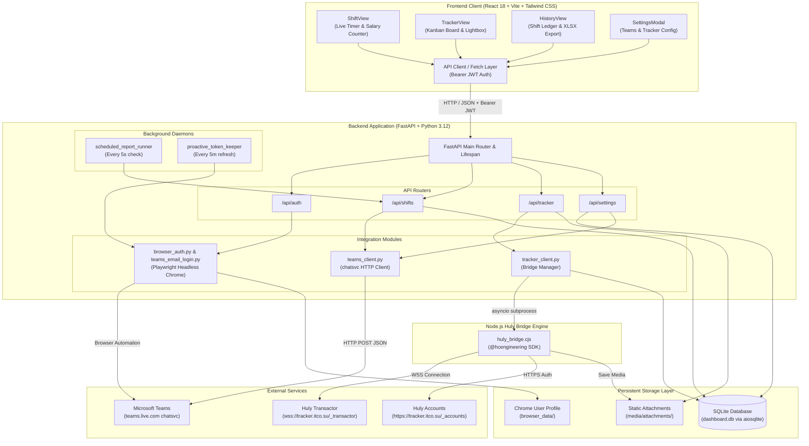

# 🏛️ ITCO Dashboard - System Architecture & Overview

## 1. Executive Summary

**ITCO Dashboard** is a specialized corporate web application designed for IT Co. engineering team members. It delivers three core capabilities:
1. **Automated Work Shift & Real-Time Salary Tracking**: Precise calculation of daily and monthly earnings based on official shift hours, arrival/departure rounding rules, real-time stopwatch timers, and automated report scheduling.
2. **Microsoft Teams Automation**: Frictionless integration with Microsoft Teams (`chatsvc` API) for automated morning greetings (*«Здравствуйте, я на рабочем месте»*) and scheduled evening daily reports with rich HTML formatting and auto-refreshed authentication.
3. **ITCO Tracker (Huly) Integration**: Direct, bi-directional real-time task tracking with Kanban board workflow, 0ms optimistic UI updates, Markdown normalization, attachment downloading, and media lightbox inspection.

---

## 2. High-Level Architecture Diagram



---

## 3. Technology Stack

| Layer | Component | Version / Technology | Key Responsibilities |
|---|---|---|---|
| **Backend Runtime** | Python | 3.12 | Core backend language |
| **API Framework** | FastAPI | >= 0.110.0 | High-performance async ASGI REST API |
| **ASGI Server** | Uvicorn | >= 0.28.0 | ASGI web server for production & dev |
| **Database** | SQLite + `aiosqlite` | >= 0.20.0 | Non-blocking asynchronous SQLite ORM/query layer |
| **Browser Engine** | Playwright Chromium | >= 1.42.0 | Headless Microsoft Teams OTP authentication & background token renewal |
| **HTTP Client** | HTTPX | >= 0.27.0 | Async connection-pooled HTTP client for Teams `chatsvc` calls |
| **Node.js Subsystem** | Node.js | >= 20.x | Executes `@hcengineering` SDK bridge script (`huly_bridge.cjs`) |
| **Huly SDK** | `@hcengineering/*` | 0.0.1 packages | Direct WebSocket protocol client for Huly Transactor & Collaborator |
| **Frontend Framework**| React | 18.3.1 | Declarative component UI |
| **Build Tooling** | Vite | 6.0.5 | Lightning fast HMR development and rollup production bundle |
| **Language** | TypeScript | 5.6.3 | Static typing across all components, API schemas, and stores |
| **Styling** | Tailwind CSS | 3.4.16 | Utility-first Refero minimalist design system |
| **Icons** | Lucide React | 0.468.0 | Crisp, minimalist vector iconography |
| **Spreadsheet Engine**| XLSX (SheetJS) | 0.18.5 | Client-side Excel `.xlsx` report generator |
| **Deployment** | Docker & Compose | Multi-stage build | Containerized runtime bound to `127.0.0.1:8000` behind Nginx SSL |

---

## 4. Directory Structure & File Manifest

```
itcoDashboard/
├── .agents/
│   ├── AGENTS.md                   # Agent operating rules & invariants
│   └── architecture/               # Comprehensive architectural documentation
│       ├── overview.md             # This document (High-level architecture & tech stack)
│       ├── tracker_integration.md  # Deep dive into Huly SDK & Bridge architecture
│       ├── shifts_and_teams.md     # Shift math, rounding rules & Teams automation
│       ├── database_schema.md      # SQLite schema, migration patterns & upserts
│       └── frontend_architecture.md# React 18, Vite, Tailwind & component breakdown
├── .github/
│   └── workflows/
│       └── deploy.yml              # Manual VPS deployment workflow (workflow_dispatch)
├── backend/
│   ├── app/
│   │   ├── __init__.py
│   │   ├── auth.py                 # JWT token generation (10-year exp) & password verification
│   │   ├── browser_auth.py         # Playwright session management & proactive token keeper
│   │   ├── curl_parser.py          # Browser DevTools cURL parser for headless server import
│   │   ├── database.py             # SQLite initialization, migrations & aiosqlite queries
│   │   ├── main.py                 # FastAPI application, lifespan runners, CORS, SPA static mount
│   │   ├── schemas.py              # Pydantic v2 schemas for all requests and responses
│   │   ├── teams_client.py         # HTTP client for Microsoft Teams chatsvc & HTML formatter
│   │   ├── teams_email_login.py    # Passwordless OTP email login state machine
│   │   ├── tracker_client.py       # Python manager for Huly bridge subcommands & logs
│   │   └── routers/
│   │       ├── __init__.py
│   │       ├── auth.py             # Login, profile, browser status & OTP endpoints
│   │       ├── settings.py         # App settings, Teams chat picker & cURL import
│   │       ├── shifts.py           # Shift lifecycle, salary stats & schedule runner
│   │       └── tracker.py          # Huly sync, status updates & attachment server
│   ├── huly_bridge.cjs             # Node.js bridge using @hcengineering Huly SDK
│   ├── huly_client/                # Node dependencies & test fixtures for Huly SDK
│   ├── tests/
│   │   └── test_backend.py         # 100% mocked backend test suite
│   ├── browser_data/               # Persistent Chromium user profile for Teams
│   ├── media/attachments/          # Downloaded Huly issue screenshots & media
│   ├── dashboard.db                # SQLite production database file
│   └── requirements.txt            # Python dependencies
├── frontend/
│   ├── src/
│   │   ├── api/
│   │   │   └── client.ts           # Centralized API fetcher with Bearer auth injection
│   │   ├── components/
│   │   │   ├── HistoryView.tsx     # Historical shifts ledger, month filter, Excel export
│   │   │   ├── LoginView.tsx       # Authentication screen
│   │   │   ├── SettingsModal.tsx   # Multi-tab modal (Teams, Tracker, Shift Reset)
│   │   │   ├── ShiftView.tsx       # Live shift stopwatch, salary cards & report editor
│   │   │   ├── Sidebar.tsx         # Navigation sidebar with status badges
│   │   │   ├── Toast.tsx           # Global notification toast container
│   │   │   ├── TrackerView.tsx     # 6-column Kanban board with Drag-and-Drop
│   │   │   ├── settings/
│   │   │   │   ├── ShiftResetTab.tsx
│   │   │   │   ├── TeamsSettingsTab.tsx
│   │   │   │   └── TrackerSettingsTab.tsx
│   │   │   └── tracker/
│   │   │       ├── ImageLightbox.tsx
│   │   │       ├── KanbanCard.tsx
│   │   │       ├── KanbanColumn.tsx
│   │   │       ├── TaskDetailModal.tsx
│   │   │       └── trackerConstants.ts
│   │   ├── hooks/
│   │   │   └── useDynamicTitle.ts  # Real-time tab title updater (20 FPS timer & earnings)
│   │   ├── types/
│   │   │   └── index.ts            # TypeScript interfaces & types
│   │   ├── App.tsx                 # Root application state & tab coordinator
│   │   ├── main.tsx                # React DOM root entry
│   │   └── index.css               # Tailwind CSS declarations
│   ├── package.json
│   ├── tailwind.config.js
│   ├── tsconfig.json
│   └── vite.config.ts
├── Dockerfile                      # Multi-stage production container definition
├── docker-compose.yml              # Local & production Docker Compose manifest
├── run.py                          # Cross-platform entry point (`--dev` or production)
├── start.bat                       # Windows launcher
├── start.sh                        # Linux/macOS launcher
└── README.md                       # User guide & quickstart documentation
```

---

## 5. Configuration & Environment Variables

The application can be configured via environment variables or a `.env` file located in the project root.

| Variable Name | Type | Default Value | Description |
|---|---|---|---|
| `DATABASE_PATH` | String | `backend/dashboard.db` (or `/app/data/dashboard.db` in Docker) | Path to the persistent SQLite database file |
| `APP_USERNAME` | String | `vepishin` | Username required for dashboard web interface login |
| `APP_PASSWORD` | String | `itcodevelopment` (override in production!) | Password required for dashboard web interface login |
| `AUTH_SECRET_KEY` | String | `itco-dashboard-super-secure-token-secret-2026` | Secret key used for signing HMAC-SHA256 JWT auth tokens |
| `APP_TIMEZONE` | String | `Europe/Moscow` | Timezone for shift scheduling, rounding, and report timestamps |
| `TZ` | String | `Europe/Moscow` | POSIX system timezone override for Docker container runtime |
| `HOST` | String | `127.0.0.1` (or `0.0.0.0` in Docker) | Host interface IP for the FastAPI ASGI server |
| `PORT` | Integer | `8000` | Port for the FastAPI backend server |
| `PYTHONUNBUFFERED` | String | `1` | Enables instantaneous stdout/stderr logging in Docker |
| `PLAYWRIGHT_DOWNLOAD_HOST` | String | `https://cdn.npmmirror.com/binaries/playwright` | Fast Chromium binary mirror for Docker builds in restricted network zones |

---

## 6. Operational & Deployment Architecture

### 6.1. Docker Container Isolation
In production, ITCO Dashboard runs inside an isolated Docker container configured with:
- **Port Security**: The port is mapped strictly to `127.0.0.1:8000:8000`. The container cannot be accessed directly from the external internet without passing through the host's Nginx reverse proxy with SSL termination.
- **Volume Mounts**:
  - `./data:/app/data`: Persists `dashboard.db`.
  - `./browser_data:/app/backend/browser_data`: Persists the Playwright Chromium profile, ensuring Microsoft Teams session tokens and cookies survive container restarts.

```
[ Internet / Browser ]
         │ HTTPS (443)
         ▼
[ Host Nginx (SSL Proxy) ]
         │ HTTP (127.0.0.1:8000)
         ▼
[ Docker Container: itco-dashboard ]
  ├── FastAPI Application (Uvicorn)
  ├── SQLite Database (/app/data/dashboard.db)
  └── Persistent Playwright Browser Data (/app/backend/browser_data)
```

### 6.2. GitHub Actions Deployment Workflow
Deployments are triggered manually on-demand via GitHub Actions (`workflow_dispatch`) targeting the VPS over SSH. The pipeline pulls the latest Git revision, builds the multi-stage Docker image, restarts the container, and verifies health without dropping persistent session states.
