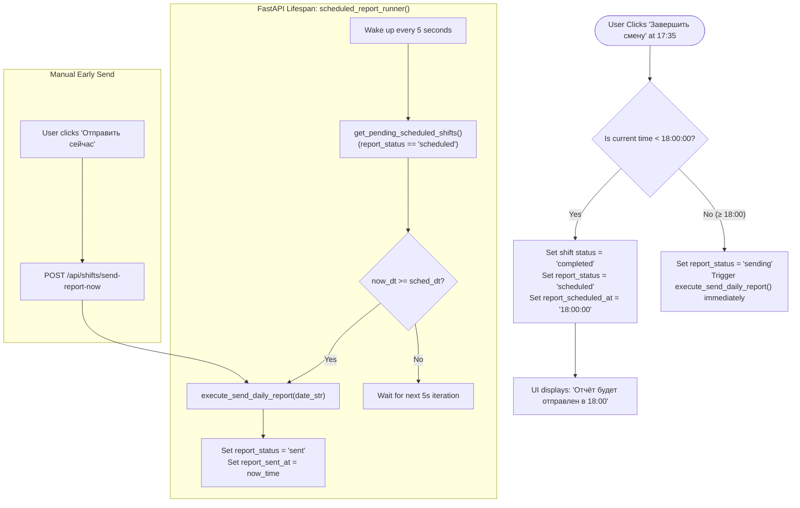

# ⏱️ Shifts, Salary Math & Microsoft Teams Automation

## 1. Overview

The **Shifts and Teams Automation** subsystem provides the core daily workflow for IT Co. employees:
1. **Precision Shift Clocking**: Automated recording of work shift start and end times with strict corporate rounding rules.
2. **Real-Time Earnings Computation**: Live accrual of daily and monthly salary down to millisecond increments (~0.05788 ₽/second).
3. **Microsoft Teams Automation**: Direct API communication with Teams `chatsvc` for morning greetings and scheduled daily report broadcasts, backed by silent session token keepers and OTP email authentication.

---

## 2. Salary & Financial Mathematical Model

```
┌────────────────────────────────────────────────────────────────────────┐
│                        SALARY & RATE FORMULAS                          │
├────────────────────────────────────────────────────────────────────────┤
│  Monthly Base Salary (M):       35,000.00 ₽ / month                    │
│  Standard Working Days (D):     21 days / month                        │
│  Standard Daily Rate (S):       1,667.00 ₽ / 8-hour shift              │
│  Hourly Rate (H):               1,667.00 / 8.0 = 208.375 ₽ / hour      │
│  Minute Rate (m):               208.375 / 60.0 ≈ 3.472917 ₽ / minute   │
│  Second Rate (s):               1,667.00 / 28,800 ≈ 0.057881944 ₽ / s  │
└────────────────────────────────────────────────────────────────────────┘
```

### 2.1. Live Daily Earning Accrual Formula
While a shift is in progress (`status == 'in_progress'`), earnings accrue continuously in real time based on elapsed seconds from the official start time ($t_{\text{start}}$) to the current timestamp ($t_{\text{now}}$):

$$\Delta t_{\text{sec}} = \max(0, t_{\text{now}} - t_{\text{start}})$$

$$\text{Earned}_{\text{today}}(t) = \Delta t_{\text{sec}} \times \left( \frac{1667.0}{28800.0} \right) = \Delta t_{\text{sec}} \times 0.057881944\text{ ₽}$$

### 2.2. Completed Shift Calculation & Overtime
When a shift is completed (`status == 'completed'`), total shift hours are computed from rounded start and end times:

$$H_{\text{worked}} = \frac{t_{\text{end\_sec}} - t_{\text{start\_sec}}}{3600.0}$$

$$\text{Earned}_{\text{shift}} = \text{round}\left( H_{\text{worked}} \times 208.375,\ 2 \right)$$

- **Standard 8.0-hour shift**: $8.0 \times 208.375 = 1,667.00\text{ ₽}$.
- **Overtime (e.g. 9.0 hours)**: $9.0 \times 208.375 = 1,875.38\text{ ₽}$ (proportionally compensated in full).

### 2.3. Monthly Cumulative Earnings
$$\text{Earned}_{\text{month}} = \sum_{k=1}^{N_{\text{completed}}} \text{Earned}_{\text{shift}, k} + \begin{cases} \text{Earned}_{\text{today}}(t) & \text{if shift is active} \\ 0 & \text{otherwise} \end{cases}$$

---

## 3. Shift Time Rounding & Policy Rules

Corporate policy defines specific rounding invariants to ensure fairness and consistency:

```
                  ┌──────────────────────────────┐
                  │      SHIFT TIMING RULES      │
                  └──────────────┬───────────────┘
                                 │
                 ┌───────────────┴───────────────┐
                 ▼                               ▼
       [ START TIME ROUNDING ]          [ END TIME ROUNDING ]
                 │                               │
       ┌─────────┴─────────┐                     │
       ▼                   ▼                     ▼
[ Arrival < 10:00 ]  [ Arrival ≥ 10:00 ]   [ Employee-Favor ]
Rounded to 10:00:00  Rounded to next hour  Always round UP to
(e.g., 09:42->10:00) (e.g., 10:15->11:00)  nearest full hour
                                           (17:31 -> 18:00:00)
                                           (19:05 -> 19:00:00)
```

### 3.1. Start Time Rounding (`get_rounded_start_time()`)
- **Early Arrival (before 10:00:00)**: Rounded to the official work start time: `10:00:00`.
- **Late Arrival (after 10:00:00)**: If seconds or minutes have elapsed, rounded up to the nearest next full hour (e.g., `10:14:22` $\rightarrow$ `11:00:00`).

### 3.2. End Time Rounding (`get_rounded_end_time()`)
- **Rounding in Employee's Favor**: Any work performed into an hour counts towards the full hour (e.g., `17:31:00` $\rightarrow$ `18:00:00`, `18:02:10` $\rightarrow$ `19:00:00`, up to `23:59:00` max).

---

## 4. Automated Daily Report Scheduling Engine



### Background Runner Implementation (`backend/app/main.py`)
```python
async def scheduled_report_runner():
    while True:
        try:
            await asyncio.sleep(5)
            pending_shifts = await get_pending_scheduled_shifts()
            now_dt = get_now_dt()
            for shift in pending_shifts:
                date_str = shift.get("date")
                sched_at = shift.get("report_scheduled_at") or shift.get("end_time") or "18:00:00"
                parts = sched_at.split(":")
                sh, sm, ss = int(parts[0]), int(parts[1]) if len(parts)>1 else 0, int(parts[2]) if len(parts)>2 else 0
                s_year, s_month, s_day = map(int, date_str.split("-"))
                sched_dt = datetime(s_year, s_month, s_day, sh, sm, ss, tzinfo=MOSCOW_TZ)

                if now_dt >= sched_dt:
                    await execute_send_daily_report(date_str)
        except asyncio.CancelledError:
            break
        except Exception:
            pass
```

---

## 5. Microsoft Teams Integration Deep Dive

### 5.1. Target API Endpoint & URL Encoding
Teams web clients send messages via the consumer `chatsvc` endpoint:
```
https://teams.live.com/api/chatsvc/consumer/v1/users/ME/conversations/{conversation_id}/messages
```

> [!IMPORTANT]
> **URL Normalization Invariant**: Teams conversation IDs contain special characters such as `:` and `@` (e.g. `19:aebc4f4bb3f746ce82fc6678d4f36fee@thread.skype`). If these characters are not percent-encoded in the URL path, Teams returns a **404 Invalid ThreadId** error.
> 
> The helper `normalize_teams_conversation_url(url)` safely converts `19:...@thread.skype` $\rightarrow$ `19%3A...%40thread.skype`.

### 5.2. HTML Formatting Engine (`format_message_for_teams`)
Teams messages require structured HTML (`messagetype: "RichText/Html"`). Standard plain text newlines cause text to collapse into unreadable blocks. `format_message_for_teams()` performs precise transformation:
1. **Paragraph Segmentation**: Splits on double newlines (`\n\s*\n`) and wraps each section in `<p>...</p>`.
2. **Single Break Preservation**: Replaces internal newlines within a paragraph with `<br/>`.
3. **Indentation Preservation**: Converts leading spaces and double spaces into non-breaking spaces (`&nbsp;`).
4. **HTML Entity Escaping**: Escapes `&`, `<`, `>` to prevent injection or parse failures.

```python
# backend/app/teams_client.py
def format_message_for_teams(message: str) -> str:
    if not message or not message.strip():
        return ""
    raw_paragraphs = re.split(r'\n\s*\n', message.strip())
    html_paragraphs = []
    for para in raw_paragraphs:
        lines = para.split('\n')
        escaped_lines = []
        for line in lines:
            esc = html.escape(line)
            leading_spaces = len(esc) - len(esc.lstrip(' '))
            if leading_spaces > 0:
                esc = ('&nbsp;' * leading_spaces) + esc[leading_spaces:]
            esc = re.sub(r' {2,}', lambda m: '&nbsp;' * len(m.group(0)), esc)
            escaped_lines.append(esc)
        para_content = "<br/>".join(escaped_lines)
        html_paragraphs.append(f"<p>{para_content}</p>")
    return "".join(html_paragraphs)
```

### 5.3. HTTP Dispatch & Automatic Text Fallback
Messages are sent via `send_teams_message()`. If the server rejects the `RichText/Html` payload with HTTP 400, the client automatically retries with a sanitized plain `Text` payload:

```python
payload = {
    "content": formatted_html,
    "messagetype": "RichText/Html",
    "contenttype": "text",
    "clientmessageid": str(int(time.time() * 1000000)),
    "properties": {}
}
if sender_name:
    payload["imdisplayname"] = sender_name
```

---

## 6. Authentication & Proactive Session Renewal

### 6.1. Token Lifecycle & Structure
Teams authentication uses a **SkypeToken** embedded as a JWT. `decode_token_info()` extracts:
- `exp`: Expiration Unix timestamp.
- `remaining_seconds`: Time remaining before expiry.
- `skypeid` / `cid`: User identification.

### 6.2. Proactive Token Keeper Daemon
To prevent token expiration during active shifts, `proactive_token_keeper()` runs in the background every 5 minutes (300s):
- If `remaining_seconds < 3600` (less than 1 hour remaining), it triggers `ensure_active_token(force_refresh=True)`.
- Playwright launches a headless, stealth Chromium instance using the persistent `backend/browser_data` profile, navigates to Teams web, and captures the refreshed `skypetoken` from internal network requests and session storage.

### 6.3. Interactive Passwordless Email OTP Login (`teams_email_login.py`)
For initial login or token setup on VPS environments without GUI access:
1. `POST /api/auth/teams-email/start {email}`: Playwright opens Microsoft login, fills email, and requests OTP code.
2. `POST /api/auth/teams-email/submit-code {session_id, code}`: Playwright fills the 6-digit verification code, enables "Keep me signed in" (KMSI), captures the generated `skypetoken`, and saves it to SQLite.
