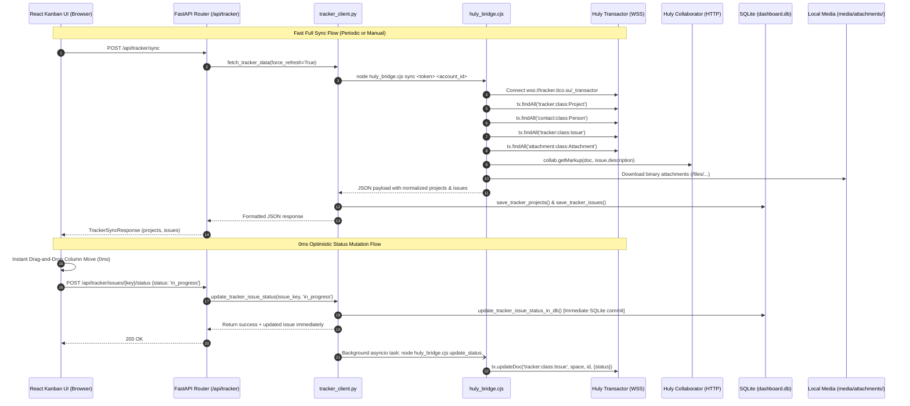

# 🎯 ITCO Tracker (Huly) Integration Architecture

## 1. Overview & Architectural Motivation

The **ITCO Tracker** subsystem integrates ITCO Dashboard directly with the organization's self-hosted **Huly** project management platform located at `https://tracker.itco.su`. 

Unlike brittle web scraping or resource-heavy headless browser sessions, ITCO Dashboard interfaces directly with Huly's native distributed object model via the official **Huly Node.js SDK** (`@hcengineering/*`).



---

## 2. Node.js SDK Bridge Subsystem (`backend/huly_bridge.cjs`)

The bridge script `backend/huly_bridge.cjs` encapsulates the `@hcengineering` libraries and communicates with Python via standard subprocess execution and JSON I/O.

### 2.1. Huly SDK Packages & Responsibilities
All SDK dependencies reside in `backend/huly_client/node_modules/@hcengineering/`:

| Package | Purpose & Functions Used |
|---|---|
| `@hcengineering/api-client` | `loadServerConfig(url)`: Fetches remote endpoint configuration (`ACCOUNTS_URL`, `COLLABORATOR_URL`, etc.).<br>`NodeWebSocketFactory`: Native Node.js WebSocket transport for transactor RPCs. |
| `@hcengineering/account-client` | `getAccountClient(url, token)`: Manages authentication, user login (`accClient.login()`), workspace selection (`wsClient.selectWorkspace('itco')`), and social identity resolution (`accountClient.getSocialIds(true)`). |
| `@hcengineering/core` | `TxOperations`: Core transaction manager for querying (`findAll`) and mutating (`updateDoc`) reactive document models.<br>`pickPrimarySocialId`: Determines the primary actor ID for transactions. |
| `@hcengineering/platform` | `getResource`, `addLocation`: Dynamic component and module resolution engine for platform resources. |
| `@hcengineering/client` & `client-resources` | Low-level transactor protocol client factories (`clientPkg.default.function.GetClient`). |
| `@hcengineering/collaborator-client` | `getCollabClient(workspace, token, collabUrl)`: Connects to rich text collaboration server and retrieves document markup trees (`collab.getMarkup()`). |
| `@hcengineering/text` & `@hcengineering/text-markdown` | `markupToJSON(rawMarkup)`: Parses internal AST markup into JSON.<br>`markupToMarkdown(json)`: Translates rich AST structure into standard Markdown. |

### 2.2. Transactor Connection Initialization
```javascript
// backend/huly_bridge.cjs
async function getClient(token, accountId) {
  let primarySocialId = '1206170148776181761';
  try {
    const config = await loadServerConfig('https://tracker.itco.su');
    const accountClient = getAccountClient(config.ACCOUNTS_URL, token);
    const socialIds = await accountClient.getSocialIds(true);
    if (socialIds && socialIds.length > 0) {
      primarySocialId = pickPrimarySocialId(socialIds)._id;
    }
  } catch (err) {}

  addLocation(clientPkg.clientId, () => Promise.resolve(require(clientResourcesPkg)));
  const clientFactory = await getResource(clientPkg.default.function.GetClient);
  const connection = await clientFactory(token, 'wss://tracker.itco.su/_transactor', {
    socketFactory: NodeWebSocketFactory,
    connectionTimeout: 15000
  });
  const tx = new TxOperations(connection, primarySocialId);
  return { connection, tx };
}
```

### 2.3. Bridge CLI Subcommands

Python invokes the bridge via `asyncio.create_subprocess_exec("node", bridge_script, cmd, *args)` in `backend/app/tracker_client.py`:

```
node backend/huly_bridge.cjs <command> [arguments...]
```

1. **`login <email> <password>`**:
   - Calls `accClient.login(email, password)` on `https://tracker.itco.su/_accounts`.
   - Calls `selectWorkspace('itco')` to obtain the workspace-scoped JWT session token.
   - Outputs: `{"success": true, "token": "...", "account": "...", "workspace": "itco", "email": "..."}`.
2. **`sync <token> <account_id>`**:
   - Establishes WebSocket connection to `wss://tracker.itco.su/_transactor`.
   - Fetches projects, persons, issues assigned to the user, attachments, and rich descriptions.
   - Downloads binary assets to `backend/media/attachments/<key>/`.
   - Outputs complete normalized project list and issue array.
3. **`update_status <token> <account_id> <issue_key> <target_status>`**:
   - Finds target issue object by key or `_id`.
   - Translates internal status name (`in_progress`, `review`, etc.) to Huly status GUID.
   - Executes `tx.updateDoc('tracker:class:Issue', target.space, target._id, { status: newStatusId })`.
   - Outputs: `{"success": true, "key": "...", "newStatus": "...", "statusId": "..."}`.

---

## 3. Data Models & Status Mappings

### 3.1. Huly Class Model Querying
- **Projects**: `tx.findAll('tracker:class:Project', {})`
- **Contacts / Persons**: `tx.findAll('contact:class:Person', {})` — Identifies current user Person `_id` by matching email (`vepishin@it-co.ru`).
- **Issues**: `tx.findAll('tracker:class:Issue', {})` — Filtered by `assignee === userPersonId`.
- **Attachments**: `tx.findAll('attachment:class:Attachment', {})` — Associated by `attachment.attachedTo === issue._id`.

### 3.2. Status Mapping Tables
Huly uses internal GUIDs and system identifiers for statuses. The bridge provides bi-directional mapping:

| Dashboard Normalized Status | Huly Status String / GUID | Display Column in Kanban |
|---|---|---|
| `todo` | `tracker:status:Todo`, `tracker:status:Backlog` | **Todo** (Gray) |
| `in_progress` | `tracker:status:InProgress` | **In progress** (Blue) |
| `review` | `69f9bb5a112005c7f3bf3c72` | **review** (Purple) |
| `ready_for_testing` | `6aa3c483f404981b798206bf` | **ready for testing** (Indigo) |
| `testing` | `69f9bb44112005c7f3bf3c6a`, `6a0c39a0364f2924b2573c25` | **Testing** (Amber) |
| `ready_to_merge` | `69fa066535e6ece6dbd474d2` | **Ready for merge** (Emerald) |
| *Excluded (Completed)* | `6a3f80269e8c40247bc05811`, `tracker:status:Done`, `tracker:status:Resolved`, `tracker:status:Canceled`, `69f9c1c3112005c7f3bf440c`, `69f9cbcc112005c7f3bf50c6` | Filtered out from active board |

---

## 4. Description Parsing & Markdown Normalization Pipeline

Raw Huly issue descriptions are stored in a proprietary markup schema managed by the Collaborator service. The bridge executes a multi-stage normalization pipeline to convert this into clean GitHub Flavored Markdown:

```
[ Collaborator Markup AST ]
         │ collab.getMarkup()
         ▼
[ JSON Document Tree ]
         │ markupToJSON()
         ▼
[ Raw Markdown String ]
         │ markupToMarkdown()
         ▼
[ HTML & Span Stripping ]
         │ Clean <span ...> tags
         ▼
[ Technical Boilerplate Cleanup ]
         │ Remove "image.png 12.3 kB • Download • Delete"
         │ Unescape literal \n and \$
         ▼
[ Semantic Label Formatting ]
         │ "ОР:" -> "**ОР:** "
         │ "ФР:" -> "**ФР:** "
         │ "Вопрос:" -> "**Вопрос:** "
         │ "Ответ:" -> "**Ответ:** "
         ▼
[ Paragraph Soft-Wrap Normalization ]
         │ Join broken sentences inside text paragraphs
         │ Preserve numbered lists (1. ...), bullet lists (*, •), and image blocks
         ▼
[ Normalized Clean Markdown ]
```

### Soft-Wrap Unwrapping Algorithm
Huly collaborator markup often injects hard newline characters in the middle of sentences. The parser unwraps these while preserving genuine list structures and image tags:

```javascript
// backend/huly_bridge.cjs
const paragraphs = desc.split(/\n{2,}/);
const cleanedParas = paragraphs.map(p => {
  const lines = p.split('\n').map(l => l.trim()).filter(Boolean);
  if (lines.length === 0) return '';
  
  const isList = lines.every(l => /^(\d+\.|[-*•]|!\[)/.test(l));
  if (isList) return lines.join('\n');
  
  let result = [];
  let currentText = [];
  for (const line of lines) {
    if (/^(\d+\.|[-*•]|!\[)/.test(line)) {
      if (currentText.length > 0) {
        result.push(currentText.join(' '));
        currentText = [];
      }
      result.push(line);
    } else {
      currentText.push(line);
    }
  }
  if (currentText.length > 0) {
    result.push(currentText.join(' '));
  }
  return result.join('\n');
});
```

---

## 5. Attachments & Media Pipeline

### 5.1. Download & Storage Pipeline
1. **Direct Attachment Objects**: Identified via `attachment:class:Attachment`. The bridge downloads the raw file stream using HTTPS with the user's workspace Bearer token from:
   `https://tracker.itco.su/files/<WORKSPACE>/<filename>?file=<fileId>&workspace=<WORKSPACE>`
2. **Inline Markdown Images**: Regex searches for `!\[(.*?)\]\((.*?)\)` inside the markdown body to catch any embedded screenshots.
3. **Local Storage**: Saved to `backend/media/attachments/<issue_key>/<fileId_prefix>.png`. If the file already exists on disk, download is skipped for speed.
4. **URL Rewriting**: Bridge replaces all Huly file paths in descriptions with the local static endpoint:
   `/api/tracker/attachments/<issue_key>/<fileId_prefix>.png`

### 5.2. Static Serving & Frontend Lightbox
- **FastAPI Endpoint**: `GET /api/tracker/attachments/{issue_key}/{filename}` (`backend/app/routers/tracker.py`) performs path validation to prevent traversal and streams the image with appropriate MIME types (`image/png`, `image/jpeg`, `image/webp`, `image/svg+xml`).
- **Interactive Lightbox**: Clicking any image in `TaskDetailModal.tsx` opens `ImageLightbox.tsx`, providing a full-screen backdrop-blurred preview with zoom scaling and `Escape` key dismiss.

---

## 6. Real-Time Synchronization & 0ms Optimistic UI Strategy

### 6.1. 0ms Optimistic UI Updates
When a card is dragged to a new column on the Kanban board:
1. **UI State (`TrackerView.tsx`)**: Instantly relocates the card to the target column with zero perceived latency.
2. **Pending Map (`pendingUpdatesRef`)**: Records `issueKey -> targetStatus` in a React `useRef` to prevent incoming polling syncs from overriding the user's ongoing interaction.
3. **Local SQLite Update (`database.py`)**: `update_tracker_issue_status_in_db()` immediately updates the local database row so page refreshes retain the new state.
4. **Background Async Mutation**: Python schedules `asyncio.create_task(_apply_status_change_in_tracker())`, invoking `node huly_bridge.cjs update_status` in the background.

### 6.2. Background Polling Strategy
- **Visibility-Aware Interval**: A 12-second polling loop runs `api.syncTracker()` only when `!document.hidden`.
- **Window Focus Sync**: An event listener on `window.addEventListener('focus', ...)` immediately triggers a silent background sync whenever the developer switches back to the dashboard tab.
